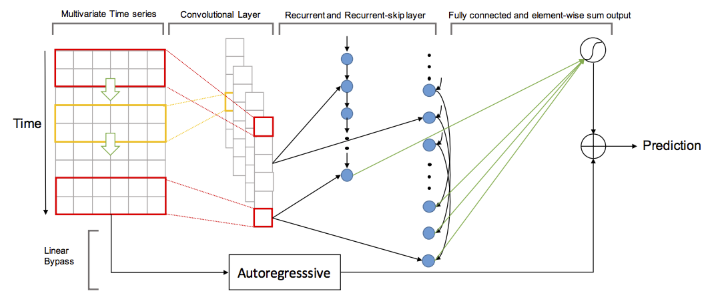

# LSTNet

- This repo contains an MXNet implementation of [this](https://arxiv.org/pdf/1703.07015.pdf) state of the art time series forecasting model.
- You can find my blog post on the model [here](https://opringle.github.io/2018/01/05/deep_learning_multivariate_ts.html)

- A Gluon implementation is available [here](https://github.com/safrooze/LSTNet-Gluon)

## Running the code

1. Download & extract the training data: 
    - `$ mkdir data && cd data`
    - `$ wget https://github.com/laiguokun/multivariate-time-series-data/raw/master/electricity/electricity.txt.gz`
    - `$ gunzip electricity.txt.gz`
2. Train the model (~1.5 hours on Tesla K80 GPU with default hyperparams):
    - `$ cd src && python lstnet.py --gpus=0`

## Results & Comparison

- The model in the paper predicts with h = 3 on electricity dataset, achieving *RSE = 0.0906, RAE = 0.0519 and CORR = 0.9195* on test dataset
- This MXNet implementation achieves *RSE = 0.0880, RAE = 0.0542* after 100 epochs on the validation dataset
- Saved model checkpoint files can be found in `models/`

## Hyperparameters

The default arguements in `lstnet.py` achieve equivalent performance to the published results. For other datasets, the following hyperparameters provide a good starting point:

- q = {2^0, 2^1, ... , 2^9} (1 week is typical value)
- Convolutional num filters  = {50, 100, 200}
- Convolutional kernel sizes = 6,12,18
- Recurrent state size = {50, 100, 200}
- Skip recurrent state size = {20, 50, 100}
- Skip distance = 24 (tune this based on domain knowledge)
- AR lambda = {0.1,1,10}
- Adam optimizer LR = 0.001
- Dropout after every layer =  {0.1, 0.2}
- Epochs = 100
